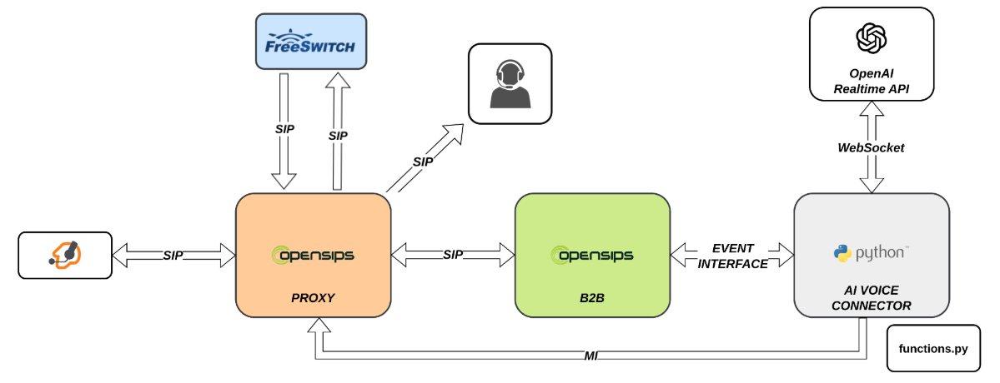

# OpenSIPS AI Voice Connector - Demo Summit Setup
## Getting Started

This setup was used at the OpenSIPS Summit 2025 for a workshop on
how to build a Voice Agent using OpenSIPS and AI Voice Connector.

In order to run this example, you need to
setup [Docker](https://www.docker.com/) on your host and then run:

``` shell
git clone https://github.com/OpenSIPS/opensips-ai-voice-connector-ce.git
cd opensips-ai-voice-connector-ce/examples/demo-summit
# edit the .env file and adjust the settings accordingly (HOST_IP and OPERATOR)
# set the API_KEY in conn/demo.ini
# then run
docker compose up -d

# if you want to rebuild the images
docker compose up -d --build
```

In this setup, we are using the following services:
- the **AI Voice Connector engine**, using the OpenAI flavor
- one **OpenSIPS instance**, acting as a SIP proxy
- another **OpenSIPS instance**, using B2BUA module as needed by the AI Voice Connector
- **FreeSWITCH**, as a media server used when calling the human operator for creating a conference call

Here is a diagram of the setup:

